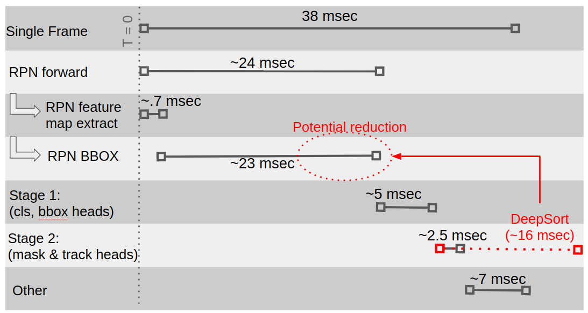

# MaskTrackRCNN with a DeepSort Tracking Head for Real-Time video instance segmentation
# Implemented in Python with Pytorch 1.6, CUDA 10.1

## Introduction
This repo serves as a jumping-off point for anyone looking to optimize MaskTrackRCNN instance segmentation systems for real-time applications. The primary contribution of this repo is the integration of the original MaskTrackRCNN work with DeepSort real-time object tracking. For some context, the original purpose of this work was to determine whether or not the efficiency of multi-object tracking (MOT) in a MaskTrackRCNN framework (show below) could be improved by reducing the region that needs to be search for region-proposals. See Figures 1 and 2 below for an explaination of this reasoning. In short, I found that in cases presented by the YouTube-VOS dataset, the time-reduction was un-noticable likely due to the optimization of non-max supression for the region proposal network. However, object tracking from deepsort can still be useful for tracking trajectories of objects in many real-time applications - providing a sort of "intuition" for where objects will be in future frames. I will not be integrating this code at the sytem level, so feel free to use it at will, however I will not be supportuing this repo regularly after a few weeks from this code's publication.

MackTrackRCNN Paper:
```
@article{ Yang2019vis,
  author = {Linjie Yang and Yuchen Fan and Ning Xu},  
  title = {Video instance segmentation},
  journal = {CoRR},
  volume = {abs/1905.04804},
  year = {2019},
  url = {https://arxiv.org/abs/1905.04804}
}
```
[MaskTrackRCNN Github](https://github.com/youtubevos/MaskTrackRCNN)

DeepSort Paper:
```
@article{ Wojke2017,
  author = {Nicolai Wojke, Alex Bewley, Dietrich Paulus},
  title = {Simple Online and Realtime Tracking with a Deep Association Metric},
  journal = {arXiv},
  volume = {Preprint},
  url = {https://arxiv.org/abs/1703.07402}
}
```
[DeepSort Python Implementatin Github](https://github.com/ZQPei/deep_sort_pytorch)


<figcaption>Figure 1</figcaption>


<figcaption>Figure 2</figcaption>


## Installation/Training
Follow installation and setup instructions from the MaskTrackRCNN Github. I set this up on Ubuntu 20.04 with a conda environment. See the output on my "conda list" above at '~/mycondalist.txt'. Setting up pytorch properly for MaskTrackRCNN from the source code will be a little annoying, but will eventually work. There were some simple changes to depreciated C++ code that I had to make as follows:

See: 'MaskTrackRCNN_DeepSort/mmdet/ops/roi_pool/src/roi_pool_cuda.cpp'
```
> //#define CHECK_CUDA(x) AT_CHECK(x.type().is_cuda(), #x, " must be a CUDAtensor ")
> #define CHECK_CUDA(x) TORCH_CHECK(x.is_cuda(), #x, " must be a CUDAtensor ")

```
See:'MaskTrackRCNN_DeepSort/mmdet/ops/roi_align/src/roi_align_cuda.cpp'
```
> //#define CHECK_CUDA(x) AT_CHECK(x.type().is_cuda(), #x, " must be a CUDAtensor ")
> #define CHECK_CUDA(x) TORCH_CHECK(x.is_cuda(), #x, " must be a CUDAtensor ")
```

## Evaluation
After downloading the training and evaluation data from the CodaLab YoutubeVOS dataset (instructions in MaskTrackRCNN repo), there are two main modes of evaluation and demo that you can run.

1. Evaluate the trained model on the youtubevos eval set:
```
python3 tools/test_video.py configs/masktrack_rcnn_r50_fpn_1x_youtubevos.py models/MaskTrackRCNN_epoch_12.pth --out outputs/results.pkl --eval segm
```
2. Run it live on a realsense415d RGB-D camera.
```
python3 tools/test_video_live.py configs/masktrack_rcnn_r50_fpn_1x_live_deepsort.py models/MaskTrackRCNN_epoch_12.pth --out outputs/results.pkl
```

