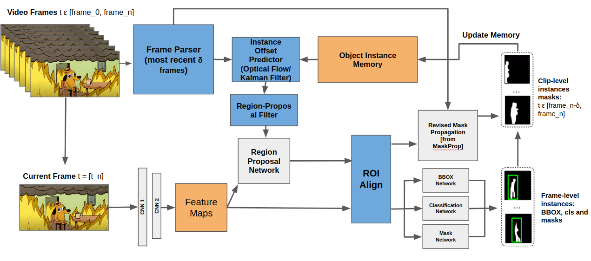

# MaskTrackRCNN with a DeepSort Tracking Head for Real-Time video instance segmentation
### Implemented in Python with Pytorch 1.6, CUDA 10.1

## Introduction
This repo serves as a jumping-off point for system integration of semantic instance segmentation and multi-object tracking in real-time applications. The initial goal of this work was the explore possible optimizations in semantic segmentation through tried-and-true methods of multi-object tracking (DeepSort). However, I found empirallcy that the region proposal network built into MaskTrackRCNN (using non-max supression) performs exceedingly well in proposing regions of interest (ROIs) to the rest of the network without clues from object tracking. Regardless, this system still has value in it's added object tracking functionality (kalman filter) and can hopefully be built into a physical platform eventually with a complete system pipeline. I will not be integrating this code at the sytem level, so feel free to use it at will, however I will not be supportuing this repo regularly after a few weeks from this code's publication.

MackTrackRCNN Paper:
```
@article{ Yang2019vis,
  author = {Linjie Yang and Yuchen Fan and Ning Xu},  
  title = {Video instance segmentation},
  journal = {CoRR},
  volume = {abs/1905.04804},
  year = {2019},
  url = {https://arxiv.org/abs/1905.04804}
}
```
[MaskTrackRCNN Github](https://github.com/youtubevos/MaskTrackRCNN)

DeepSort Paper:
```
@article{ Wojke2017,
  author = {Nicolai Wojke, Alex Bewley, Dietrich Paulus},
  title = {Simple Online and Realtime Tracking with a Deep Association Metric},
  journal = {arXiv},
  volume = {Preprint},
  url = {https://arxiv.org/abs/1703.07402}
}
```
[DeepSort Python Implementatin Github](https://github.com/ZQPei/deep_sort_pytorch)


<figcaption>Figure 1: original idea was to use the anticipated object locations to reduce the region proposal network's search area. This reduction was empirically found to be negligable. However, this system could still be used to integrate semantic segmentation with robotic perception algoriothms & path planning.</figcaption>


## Installation/Training
Follow installation and setup instructions from the MaskTrackRCNN Github. I set this up on Ubuntu 20.04 with a conda environment. See the output on my "conda list" above at '~/mycondalist.txt'. Setting up pytorch properly for MaskTrackRCNN from the source code will be a little annoying, but will eventually work. There were some simple changes to depreciated C++ code that I had to make as follows:

See: 'MaskTrackRCNN_DeepSort/mmdet/ops/roi_pool/src/roi_pool_cuda.cpp'
```
> //#define CHECK_CUDA(x) AT_CHECK(x.type().is_cuda(), #x, " must be a CUDAtensor ")
> #define CHECK_CUDA(x) TORCH_CHECK(x.is_cuda(), #x, " must be a CUDAtensor ")

```
See:'MaskTrackRCNN_DeepSort/mmdet/ops/roi_align/src/roi_align_cuda.cpp'
```
> //#define CHECK_CUDA(x) AT_CHECK(x.type().is_cuda(), #x, " must be a CUDAtensor ")
> #define CHECK_CUDA(x) TORCH_CHECK(x.is_cuda(), #x, " must be a CUDAtensor ")
```

## Evaluation
After downloading the training and evaluation data from the CodaLab YoutubeVOS dataset (instructions in MaskTrackRCNN repo), there are two main modes of evaluation and demo that you can run.

1. Evaluate the trained model on the youtubevos eval set:
```
python3 tools/test_video.py configs/masktrack_rcnn_r50_fpn_1x_youtubevos.py models/MaskTrackRCNN_epoch_12.pth --out outputs/results.pkl --eval segm
```
2. Run it live on a realsense415d RGB-D camera.
```
python3 tools/test_video_live.py configs/masktrack_rcnn_r50_fpn_1x_live_deepsort.py models/MaskTrackRCNN_epoch_12.pth --out outputs/results.pkl
```

